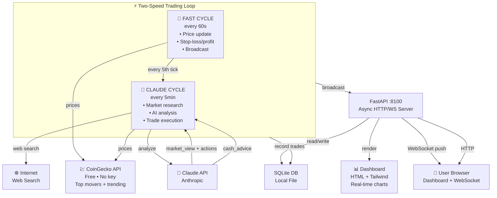

# 💎 LGRC — Let's Get Rich with Crypto

> **AI-Powered Autonomous Crypto Trading Simulator**
> 
> Watch Claude make intelligent trading decisions in real-time, execute trades automatically, and track profits live. No manual clicking — just pure AI trading.

 

## 🎯 What It Does

LGRC is an autonomous cryptocurrency trading simulator that:

1. **Analyzes Markets** — Claude uses web search to find the best crypto opportunities RIGHT NOW
2. **Executes Trades Automatically** — No manual clicking, no delay, full automation
3. **Manages Risk** — Auto stop-loss (−5%), auto take-profit (+12%), position limits
4. **Tracks P&L in Real-Time** — WebSocket-powered live dashboard with portfolio chart
5. **Two-Speed Trading** — Fast price checks every 60s, full AI analysis every 5 minutes
6. **Deposit/Withdraw** — Add or remove cash anytime, Claude suggests when to act
7. **Enterprise Grade** — Production-ready: async SQLAlchemy, structured logging, error recovery

**Goal:** 25% weekly returns through smart momentum trading.

## 🏗️ Architecture



## 🚀 Quick Start

### Option 1: Automated Deployment (Recommended)

```bash
# Clone or download the repo
cd lgrc

# Run deploy script (sets up .env, builds, starts)
chmod +x deploy.sh
./deploy.sh
```

The script will:
- ✓ Check for Docker
- ✓ Prompt for Anthropic API key
- ✓ Create `.env`
- ✓ Build the Docker image
- ✓ Start the container
- ✓ Show you the URL

### Option 2: Manual Setup

```bash
# 1. Copy environment template
cp .env.example .env
# Edit .env and add your ANTHROPIC_API_KEY

# 2. Build Docker image
docker compose build

# 3. Start the simulator
docker compose up -d

# 4. View logs (optional)
docker compose logs -f
```

### 3. Open the Dashboard

Visit **http://localhost:8100** in your browser.

## 📊 Dashboard Features

### Status Metrics (Top 5 Cards)
- **Total Deposited** — Your capital basis
- **Invested Now** — USD deployed in positions
- **Available Cash** — Ready for next trade
- **Portfolio Value** — Total holdings
- **Total P&L** — Profit/loss vs. basis

### Cash Management
- **Add Cash** — Deposit more capital anytime (market opportunity)
- **Withdraw** — Lock in profits or de-risk
- **Claude's Advice** — AI recommends when to add/withdraw cash

### Trading View
- **Portfolio Chart** — Real-time line chart, green if profitable
- **Open Positions** — Symbol, Qty, Cost, Current, P&L%, Value
- **Recent Trades** — BUY/SELL tags, time, realized P&L

### AI Analysis
- **Market View** — Claude's 2-3 sentence take on the market
- **Action Pills** — BUY SOL, SELL XRP, HOLD ETH
- **Next Updates** — Countdown to next price check & AI cycle

## ⚙️ Configuration

Edit `.env` to customize:

| Setting | Default | Meaning |
|---------|---------|---------|
| `STARTING_CAPITAL` | $1,000 | Initial sim balance |
| `TARGET_WEEKLY_PCT` | 25% | Profit goal (for Claude context) |
| `FAST_INTERVAL_SECONDS` | 60 | Price check interval (seconds) |
| `CLAUDE_INTERVAL_SECONDS` | 300 | AI analysis interval (seconds) |
| `MAX_POSITIONS` | 3 | Max open positions |
| `MAX_POSITION_PCT` | 40% | Max % of portfolio per trade |
| `STOP_LOSS_PCT` | 5% | Auto sell if down 5% |
| `TAKE_PROFIT_PCT` | 12% | Auto sell if up 12% |
| `MIN_CASH_RESERVE_PCT` | 10% | Always keep 10% cash |

### Risk Rules (Enforced)
- Never hold > 3 positions simultaneously
- Never allocate > 40% to one trade
- Always reserve 10% cash for volatility
- Auto-liquidate winners at +12%, losers at −5%

## 🧠 How Claude Trades

Each 5-minute cycle:

1. **Research** — Web search for "best crypto breakouts today", trend analysis
2. **Analyze** — Market data (top movers, 7d % change, volume, Fear & Greed index)
3. **Decide** — BUY, SELL, or HOLD based on strategy:
   - **Momentum** — Buy coins up 5%+ on rising volume
   - **Reversal** — Buy dips when fear is extreme (Fear & Greed < 25)
   - **Trend** — Add to winners with positive 7d change
   - **News** — Buy on catalysts (regulatory approval, partnerships)
4. **Advise** — Suggest adding/withdrawing cash if needed
5. **Execute** — Buy/sell within risk limits, record trades
6. **Broadcast** — Push updates to dashboard via WebSocket

## 🛠️ Local Development

### Install Dependencies

```bash
pip install -r requirements.txt
```

### Run Without Docker

```bash
# Create SQLite DB
python -c "from app.database import init_db; import asyncio; asyncio.run(init_db())"

# Start FastAPI dev server
uvicorn app.main:app --reload --host 0.0.0.0 --port 8100
```

### Project Structure

```
lgr-sim/
├── app/
│   ├── main.py           # FastAPI app + routes
│   ├── config.py         # Pydantic settings
│   ├── database.py       # SQLAlchemy setup
│   ├── models.py         # ORM models (Portfolio, Position, Trade, etc)
│   ├── scheduler.py      # Two-speed trading loop
│   ├── analyst.py        # Claude with web search
│   ├── portfolio.py      # Trade execution engine
│   ├── prices.py         # CoinGecko API integration
│   ├── state.py          # WebSocket connection manager
│   ├── static/           # CSS/JS (minimal, Tailwind CDN)
│   └── templates/
│       └── dashboard.html # Full reactive dashboard
├── data/
│   └── sim.db           # SQLite database (auto-created)
├── Dockerfile            # Python 3.12 + FastAPI
├── docker-compose.yml    # Single service config
├── requirements.txt      # Python dependencies
├── .env.example          # Configuration template
├── .gitignore            # Git ignore rules
├── deploy.sh             # One-command deployment
└── README.md             # This file
```

### Key Modules

- **`scheduler.py`** — Runs the two-speed loop (fast + Claude cycles)
- **`analyst.py`** — Calls Claude with web search to decide trades
- **`portfolio.py`** — Execute buy/sell, apply stop-loss/take-profit, record snapshots
- **`prices.py`** — Fetch live prices from CoinGecko + Fear & Greed index
- **`state.py`** — Manage WebSocket connections, broadcast updates
- **`main.py`** — FastAPI routes: dashboard, WebSocket, deposit/withdraw, control

## 📈 Example Trading Session

**Cycle 1 (t=0s):** Claude sees BTC +2.4%, XRP +0.5%, strong volume on SOL
→ BUY XRP $300, reason: "SEC lawsuit ended, banking partnerships"

**Cycle 2 (t=60s):** Fast check → XRP up to $1.47 → positions updated, no stops triggered

**Cycle 3 (t=120s):** Fast check → XRP still good, +0.1%, no action

**Cycle 4 (t=180s):** Fast check → trigger stop-loss on old BTC position (down −5.2%)

**Cycle 5 (t=240s):** Fast check → countdown...

**Cycle 6 (t=300s):** Claude runs! Sees Fear & Greed at 72 (greed territory), SOL breaking above $91 resistance
→ BUY SOL $300, SELL XRP (take profit +8%), suggests WITHDRAW $100 "lock in gains, market overheated"

**Dashboard shows:**
```
Portfolio: $1,000 → $1,050 (+5%)
Positions: SOL (3.3 units @ $91), no XRP
Cash: $400 (ready for next opportunity)
Next AI cycle: 4m50s
Claude advice: Withdraw $100 ✓
```

## 🔌 API Endpoints

### HTTP

- `GET /` — Render dashboard with current state
- `GET /health` — Healthcheck (used by Docker, CI/CD)
- `POST /api/deposit` — Deposit cash (body: `{amount: float, note: string}`)
- `POST /api/withdraw` — Withdraw cash (body: `{amount: float, note: string}`)
- `POST /api/pause` — Pause trading loop
- `POST /api/resume` — Resume trading loop
- `POST /api/reset` — Reset portfolio (keeps trade history)

### WebSocket

- `WS /ws` — Live updates
  - **Ping** (every 1s): `{type: "ping", next_cycle_in, next_ai_in}`
  - **Full update** (per cycle): `{portfolio, positions, trades, analysis, cash_advice, ...}`

## 📦 Dependencies

| Package | Purpose |
|---------|---------|
| `fastapi` | Web framework |
| `uvicorn` | ASGI server |
| `sqlalchemy` | ORM + async |
| `aiosqlite` | Async SQLite |
| `anthropic` | Claude API |
| `httpx` | Async HTTP (web search) |
| `pydantic-settings` | Config management |
| `structlog` | Structured logging |
| `jinja2` | Template rendering |

## 🔒 Security

- API key stored in `.env` (not in code)
- SQLite local only (no remote DB)
- No authentication needed (local simulator)
- Trades auto-limited by risk rules (can't lose more than configured)

For production deployment, add:
- Authentication (OAuth2/JWT)
- HTTPS (SSL certificates)
- Environment separation (dev/prod)

## 🐛 Troubleshooting

### Container won't start
```bash
docker compose down
rm -f data/sim.db
docker compose up -d
```

### Dashboard shows "DISCONNECTED"
- Check browser console for WebSocket errors
- Verify port 8100 is not blocked by firewall
- Restart container: `docker compose restart`

### Claude not making trades
- Check logs: `docker compose logs -f | grep analyst`
- Verify API key in `.env` is valid
- Check market data: `curl http://localhost:8100/health`

### High CPU usage
- Normal during Claude's web search (30-35s per analysis)
- Two-speed design mitigates this (price checks are fast)

## 🤝 Contributing

Improvements welcome! Some ideas:
- Additional risk models (Kelly criterion, Sharpe ratio)
- More data sources (on-chain metrics, social sentiment)
- Backtesting engine
- Multi-exchange support (Binance API, etc)
- Export CSV reports

## 📄 License

MIT License — use freely, fork, modify.

## 🎓 Learn More

- [Anthropic API Docs](https://docs.anthropic.com/)
- [CoinGecko API](https://www.coingecko.com/api/documentation)
- [FastAPI Docs](https://fastapi.tiangolo.com/)
- [SQLAlchemy Async](https://docs.sqlalchemy.org/en/20/orm/extensions/asyncio.html)

---

**Made with ❤️ by autonomous traders everywhere.**

Built for the week of May 15, 2026. May the profits be ever in your favor. 🚀
