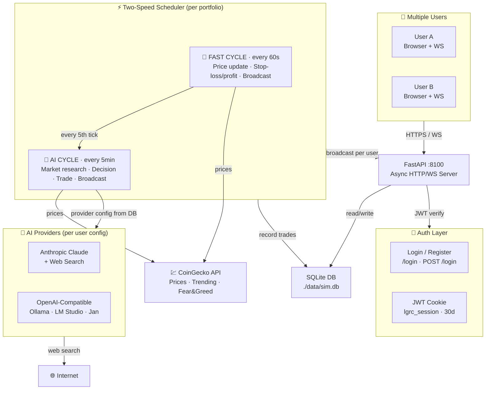

# 💎 LGRC — Let's Get Rich with Crypto

> **AI-Powered Autonomous Crypto Trading Simulator — Multi-User Edition**
>
> Multiple users can each run their own isolated portfolio. Choose your AI provider — Claude with live web search, or any local model via Ollama / LM Studio. Fully autonomous: market research, trade decisions, and risk management happen automatically every 5 minutes.

   

---

## 🎯 What It Does

LGRC is an autonomous cryptocurrency trading simulator that:

1. **Analyzes Markets** — AI uses web search (Claude) or live CoinGecko data (local models) to find opportunities
2. **Executes Trades Automatically** — No manual clicking; full BUY/SELL automation with reason logging
3. **Manages Risk** — Auto stop-loss (−5%), auto take-profit (+12%), position limits enforced on every trade
4. **Tracks P&L in Real-Time** — WebSocket-powered live dashboard; portfolio chart restores history on refresh
5. **Two-Speed Trading** — Fast price checks every 60s, full AI analysis every 5 minutes
6. **Multi-User & Isolated** — Each user registers their own account; portfolios, trades, and AI keys are private
7. **Pluggable AI** — Switch between Anthropic Claude, Ollama, LM Studio, Jan, or any OpenAI-compatible API from the dashboard UI

**Goal:** 25% weekly returns through smart momentum trading.

---

## 🏗️ Architecture



### Data Isolation Model

Each user's data is fully isolated at the database layer:

```
User (id, username, password_hash)
 └── Portfolio (user_id → users.id)
      ├── Position      (portfolio_id → portfolio.id)
      ├── Trade         (portfolio_id → portfolio.id)
      ├── CashTransaction (portfolio_id → portfolio.id)
      ├── PortfolioSnapshot (portfolio_id → portfolio.id)
      └── AnalysisLog   (portfolio_id → portfolio.id)

AISettings (user_id → users.id)   ← per-user AI provider config
```

Queries throughout the stack always filter by `portfolio_id` or `user_id` — no data ever leaks between accounts.

---

## 📋 Prerequisites

### Required Software

| Requirement | Minimum Version | Install |
|-------------|----------------|---------|
| **Docker Desktop** | 24.0+ | [mac](https://docs.docker.com/desktop/install/mac-install/) · [windows](https://docs.docker.com/desktop/install/windows-install/) · [linux](https://docs.docker.com/desktop/install/linux-install/) |
| **Docker Compose** | v2.20+ (bundled with Docker Desktop) | Included with Docker Desktop |
| **Anthropic API Key** *(optional)* | — | [console.anthropic.com](https://console.anthropic.com/) |

> **Note:** Docker Compose v2 is required (`docker compose`, not `docker-compose`). Ships bundled with Docker Desktop 4.x+. Linux without Docker Desktop: install the [Compose plugin](https://docs.docker.com/compose/install/linux/) separately.

### Verify Your Install

```bash
docker --version          # Docker version 24.x.x or higher
docker compose version    # Docker Compose version v2.x.x or higher
```

### Port Requirement

Port **8100** must be free. Check with:

```bash
# macOS / Linux
lsof -i :8100

# Windows (PowerShell)
netstat -ano | findstr :8100
```

If 8100 is in use, change the port in `docker-compose.yml`:
```yaml
ports:
  - "8200:8100"   # exposes on 8200 instead
```

### AI Provider

LGRC supports two provider types. You only need one:

| Provider | What you need |
|----------|--------------|
| **Anthropic Claude** (recommended) | API key from [console.anthropic.com](https://console.anthropic.com/) — enables live web search |
| **OpenAI-Compatible / Local** | A running local model server (Ollama, LM Studio, Jan, etc.) — no external key required |

---

## 🚀 Quick Start

### Option 1: Automated Deployment (Recommended)

```bash
# 1. Clone the repo
git clone https://github.com/manojbarot1/LGRC---Lets-Get-Rich-with-Crypto.git
cd LGRC---Lets-Get-Rich-with-Crypto

# 2. Run the deploy script — handles .env, build, and start
chmod +x deploy.sh
./deploy.sh
```

The script will:
- ✓ Check that Docker is running
- ✓ Prompt for your Anthropic API key (or leave blank for local AI)
- ✓ Create `.env` from the template
- ✓ Build the Docker image (installs all dependencies)
- ✓ Start the container in the background
- ✓ Print the dashboard URL when ready

### Option 2: Manual Setup

```bash
# 1. Clone the repo
git clone https://github.com/manojbarot1/LGRC---Lets-Get-Rich-with-Crypto.git
cd LGRC---Lets-Get-Rich-with-Crypto

# 2. Create your .env file
cp .env.example .env
# Edit .env — set ANTHROPIC_API_KEY=sk-ant-... (or leave blank)
# Optionally set SECRET_KEY=some-long-random-string

# 3. Build and start
docker compose up -d --build

# 4. Watch logs for first trading cycle
docker compose logs -f
```

### First Login

1. Visit **http://localhost:8100**
2. You'll be redirected to the login page
3. Click **Register** and create your account
4. You'll land on your personal dashboard immediately

Each user who registers gets their own isolated portfolio starting with the configured `STARTING_CAPITAL`.

### Stopping & Restarting

```bash
# Stop without losing data
docker compose stop

# Restart (all data intact)
docker compose start

# Stop and remove container (data persists in ./data/sim.db)
docker compose down

# Full reset — wipe ALL user data and start fresh
docker compose down
rm -f data/sim.db
docker compose up -d
```

> **Note:** After a full reset, all user accounts and portfolios are deleted. Everyone must register again.

---

## 🔐 Authentication

LGRC uses JWT-based session authentication:

- **Register** — create a username + password (min 3 / 6 chars)
- **Login** — credentials verified with bcrypt; a 30-day JWT is issued and stored in an httpOnly cookie
- **Session** — all routes (dashboard, API, WebSocket) reject unauthenticated requests
- **Logout** — clears the cookie; the next visit redirects to login

### Changing the JWT Secret

By default, a weak secret is used. For any shared deployment, set a strong one in `.env`:

```env
SECRET_KEY=replace-with-a-long-random-string-64-chars-minimum
```

---

## 🧠 AI Provider Configuration

Each user configures their own AI provider from the **⚙ AI** button in the dashboard navbar. Settings are stored per-user in the database — no restart needed.

### How to Open Settings

1. Log in and open the dashboard at `http://localhost:8100`
2. Click **⚙ AI** in the top-right navbar
3. Select your provider, fill in the fields
4. Click **Test Connection** — wait for ✅ Connected
5. Click **Save Settings**

> **Important:** Always paste your API key into the **API KEY field** before clicking Test Connection. The test uses whatever is currently typed in the field — not the previously saved key. If the field is blank, the test will fail with 401 Unauthorized even if a key was saved earlier.

---

### Option 1 — Anthropic Claude (paid, includes web search)

Get a key at [console.anthropic.com](https://console.anthropic.com/) → API Keys → Create Key.

| Field | Value |
|-------|-------|
| Provider | `Anthropic Claude` |
| API Key | `sk-ant-api03-...` |
| Model | `claude-sonnet-4-6` |

Claude uses **live web search** to research market news before deciding trades — best quality decisions.

---

### Option 2 — Groq (free tier, fast)

Sign up free at [console.groq.com](https://console.groq.com) — no credit card required.

| Field | Value |
|-------|-------|
| Provider | `OpenAI Compatible` |
| Base URL | `https://api.groq.com/openai/v1` |
| API Key | `gsk_...` (from Groq console) |
| Model | `llama-3.3-70b-versatile` |

Free tier: **14,400 requests/day** — LGRC uses ~288/day at most, so you'll never hit the limit.

**Other good Groq models:**

| Model | Notes |
|-------|-------|
| `llama-3.3-70b-versatile` | Best overall (recommended) |
| `gemma2-9b-it` | Lighter, very fast |
| `gemma2-29b-it` | Smarter but slower |
| `openai/gpt-oss-120b` | OpenAI-compatible reasoning model on Groq |
| `mixtral-8x7b-32768` | Longer context window |

---

### Option 3 — Google Gemini (free tier)

Get a free key at [aistudio.google.com](https://aistudio.google.com) → Get API Key.

| Field | Value |
|-------|-------|
| Provider | `OpenAI Compatible` |
| Base URL | `https://generativelanguage.googleapis.com/v1beta/openai/` |
| API Key | your Gemini key |
| Model | `gemini-1.5-flash` |

Free tier: 15 requests/minute — sufficient for the 5-minute AI cycle.

---

### Option 4 — OpenRouter (free models available)

Sign up at [openrouter.ai](https://openrouter.ai) — several models are permanently free.

| Field | Value |
|-------|-------|
| Provider | `OpenAI Compatible` |
| Base URL | `https://openrouter.ai/api/v1` |
| API Key | your OpenRouter key |
| Model | `mistralai/mistral-7b-instruct:free` |

---

### Option 5 — Ollama (completely free, runs locally)

No API key, no limits, no internet required for inference. Needs a modern Mac/PC.

```bash
# Install Ollama
brew install ollama          # macOS
# or download from https://ollama.ai for Windows/Linux

# Pull a model
ollama pull llama3.2
```

| Field | Value |
|-------|-------|
| Provider | `OpenAI Compatible` |
| Base URL | `http://host.docker.internal:11434/v1` |
| API Key | *(leave blank)* |
| Model | `llama3.2` |

> **Note:** Use `host.docker.internal` (not `localhost`) — Docker containers can't reach `localhost` on your machine directly. On Linux use `http://172.17.0.1:11434/v1` instead.

Other Ollama models to try: `mistral`, `llama3.1`, `phi3`, `qwen2.5`

---

### Provider Comparison

| Provider | Cost | Speed | Quality | Web Search |
|----------|------|-------|---------|------------|
| Anthropic Claude | Paid | Medium (30–60s with search) | ⭐⭐⭐⭐⭐ | ✅ Yes |
| Groq | Free | Fast (1–3s) | ⭐⭐⭐⭐ | ❌ No |
| Google Gemini | Free | Fast (2–5s) | ⭐⭐⭐⭐ | ❌ No |
| OpenRouter (free) | Free | Medium | ⭐⭐⭐ | ❌ No |
| Ollama (local) | Free | Varies | ⭐⭐⭐ | ❌ No |

All providers without web search still get **live CoinGecko price data** (top 20 movers, Fear & Greed index, trending coins) — the AI prompt is adapted automatically.

---

## 📊 Dashboard Features

### Navbar (always visible)

| Element | Description |
|---------|-------------|
| `👤 username` | Your account name (left, next to logo) |
| `LIVE / PAUSED` | Trading loop status badge |
| `Up: Xd Xh Xm Xs` | How long this session has been running |
| `AI: Xm Xs` | Countdown to next AI analysis cycle |
| `⚡ Xs` | Countdown to next price check |
| `⚙ AI` | Open AI provider settings modal |
| `⏸ / ▶` | Pause / resume your trading loop |
| `Sign out` | Log out |

### Status Metrics (5 cards)

- **Total Deposited** — Your net capital basis (deposits minus withdrawals)
- **Invested Now** — USD currently deployed in open positions
- **Available Cash** — Cash ready for next trade
- **Portfolio Value** — Total holdings (cash + positions at current price)
- **Total P&L** — Profit/loss vs. deposited basis, with % change

### Cash Management

- **Add Cash** — Deposit more capital at any time
- **Withdraw** — Lock in profits or de-risk
- **AI's Smart Recommendation** — The AI advises when to add or withdraw based on market conditions

### Performance Chart

- Line chart of portfolio value over time
- **Persists across page refreshes** — history loaded from DB on connect
- Green = profitable vs. deposited, Red = loss
- Dashed baseline shows starting capital

### Open Positions Table

| Column | Description |
|--------|-------------|
| Symbol | Coin ticker |
| Qty | Units held (4 sig figs) |
| Cost | Average purchase price |
| Now | Current market price |
| P&L | Unrealized profit/loss ($  and %) |
| Value | Current position value |
| Opened | Date and time position was opened |

### Recent Trades Feed

Shows last 20 trades with: BUY/SELL tag · symbol · quantity × price · realized P&L · full date+time.

### AI Analysis Panel

- **Market View** — 2-3 sentence summary from the AI after each analysis cycle
- **Action Pills** — The specific decisions made: `BUY SOL $300`, `SELL XRP`, `HOLD ETH`
- **Claude's Cash Recommendation** — ADD or WITHDRAW suggestion with reasoning

---

## ⚙️ Configuration

Edit `.env` to customize simulator behaviour:

| Setting | Default | Meaning |
|---------|---------|---------|
| `ANTHROPIC_API_KEY` | *(empty)* | Your Anthropic API key (can be set per-user in UI instead) |
| `SECRET_KEY` | `lgrc-change-me-in-production` | JWT signing secret — change for shared deployments |
| `STARTING_CAPITAL` | `1000.0` | Initial USD balance for each new user |
| `TARGET_WEEKLY_PCT` | `25.0` | Profit target % (given to AI as context) |
| `FAST_INTERVAL_SECONDS` | `60` | Price check + stop-loss cycle |
| `CLAUDE_INTERVAL_SECONDS` | `300` | AI analysis + trade execution cycle |
| `MAX_POSITIONS` | `3` | Max simultaneous open positions per user |
| `MAX_POSITION_PCT` | `0.40` | Max portfolio % per single trade |
| `STOP_LOSS_PCT` | `0.05` | Auto-sell if position falls 5% |
| `TAKE_PROFIT_PCT` | `0.12` | Auto-sell if position rises 12% |
| `MIN_CASH_RESERVE_PCT` | `0.10` | Always keep 10% cash |
| `DATABASE_URL` | `sqlite+aiosqlite:///./data/sim.db` | SQLite path |

### Risk Rules (Hard-Enforced)

These limits are applied in `portfolio.py` regardless of what the AI decides:

- Never hold more than `MAX_POSITIONS` positions simultaneously
- Never allocate more than `MAX_POSITION_PCT` of total portfolio value to one trade
- Always maintain `MIN_CASH_RESERVE_PCT` in cash before any buy
- Auto-liquidate: sell entire position when stop-loss or take-profit threshold is crossed

---

## 🔄 How the Scheduler Works

```
Startup → AI cycle (tick 0)
    ↓
Every 60s:
  if tick % 5 == 0 → AI cycle (full analysis + trades)
  else             → Price cycle (prices + stop/take checks only)
    ↓
Both cycles:
  • Iterate over ALL running portfolios concurrently (asyncio.gather)
  • Each portfolio uses its own user's AI provider settings
  • Broadcast result only to WebSocket connections belonging to that portfolio
```

**Fast cycle** (every 60s, ~1–2s execution time):
1. Fetch latest prices from CoinGecko for all held symbols + top 20 movers
2. Check every open position against stop-loss and take-profit thresholds
3. Execute any triggered sells
4. Record a portfolio snapshot (used for the performance chart)
5. Broadcast to the user's WebSocket connections

**AI cycle** (every 5 min, ~30–60s execution time):
1. Everything in the fast cycle, plus:
2. Fetch full market snapshot (top movers, trending, Fear & Greed index)
3. Call the AI provider with a structured prompt including portfolio state + market data
4. Parse the JSON response (BUY / SELL / HOLD actions + cash advice + market view)
5. Execute the AI's trade decisions within risk limits
6. Save an `AnalysisLog` row to the DB
7. Broadcast the updated state + AI analysis text

---

## 🛠️ Local Development

### Run Without Docker

```bash
# Install dependencies
pip install -r requirements.txt

# Init DB
python -c "import asyncio; from app.database import init_db; asyncio.run(init_db())"

# Start dev server (hot reload)
uvicorn app.main:app --reload --host 0.0.0.0 --port 8100
```

### Project Structure

```
lgr-sim/
├── app/
│   ├── main.py           # FastAPI app: all routes, auth, WebSocket
│   ├── auth.py           # JWT utilities: hash_password, create_token, get_current_user
│   ├── config.py         # Pydantic settings (reads from .env)
│   ├── database.py       # SQLAlchemy engine, session factory, init_db + migration
│   ├── models.py         # ORM models: User, Portfolio, Position, Trade, etc.
│   ├── scheduler.py      # Two-speed loop: iterates all running portfolios concurrently
│   ├── analyst.py        # Multi-provider AI: Anthropic (web search) + OpenAI-compat
│   ├── portfolio.py      # Trade execution engine: buy/sell/snapshot (portfolio-scoped)
│   ├── prices.py         # CoinGecko API: top movers, trending, Fear & Greed index
│   ├── state.py          # Per-portfolio WebSocket connections + live state cache
│   ├── static/           # Static assets (minimal)
│   └── templates/
│       ├── dashboard.html  # Full reactive dashboard (Tailwind + Chart.js + WebSocket)
│       └── login.html      # Login / Register page (same dark theme)
├── data/
│   └── sim.db            # SQLite database (auto-created; gitignored)
├── Dockerfile            # Python 3.12-slim + pip install
├── docker-compose.yml    # Single service: port 8100, volume mounts
├── requirements.txt      # Pinned Python dependencies
├── .env.example          # Configuration template
├── deploy.sh             # One-command deployment script
└── README.md             # This file
```

### Key Modules Explained

**`auth.py`**
- `hash_password(plain)` / `verify_password(plain, hashed)` — bcrypt via passlib (pinned to bcrypt 3.x)
- `create_token(user_id, username)` — signs a 30-day JWT with the `SECRET_KEY`
- `decode_token(token)` — verifies and decodes; returns `None` on any error
- `get_current_user(request, session)` — reads `lgrc_session` cookie, decodes JWT, queries User row

**`analyst.py`**
- `_build_prompt(...)` — constructs a structured trading prompt; task section adapts for web-search vs. data-only
- `_call_anthropic(api_key, model, prompt)` — uses Anthropic SDK with web-search beta; falls back to plain message if beta unavailable
- `_call_openai_compat(api_key, base_url, model, prompt)` — pure `httpx` POST to `/chat/completions`; no extra dependency
- `_extract_json(text)` — robust JSON extraction: tries direct parse, code block, then scans from last `{` backwards (handles preamble text from web-search responses)
- `analyze_and_decide(...)` — dispatches to the right provider based on `ai_config`

**`portfolio.py`**
Every function is scoped to a specific portfolio:
- `get_positions(session, portfolio_id)` — only returns positions belonging to that portfolio
- `execute_buy/sell(session, portfolio, ...)` — creates Position and Trade rows with `portfolio_id`
- `record_snapshot(session, portfolio, prices)` — saves PortfolioSnapshot with `portfolio_id` (drives the chart)

**`state.py`**
- `_connections: dict[int, list[WebSocket]]` — maps `portfolio_id → [ws1, ws2, ...]`
- `ws_connect(ws, portfolio_id)` — accepts the WebSocket and registers it under the portfolio
- `broadcast_update(session, portfolio, ...)` — sends only to the portfolio's connections; queries trades/history filtered by `portfolio_id`
- Per-portfolio caches: `last_analysis[portfolio_id]`, `last_actions[portfolio_id]`, `last_cash_advice[portfolio_id]`

**`scheduler.py`**
- `_run_all(cycle_fn)` — fetches all running portfolio IDs in one query, then fires `asyncio.gather(*[cycle_fn(pid) for pid in ids])`
- Each cycle fetches the user's `AISettings` from DB to pick the right provider
- Exceptions in one portfolio's cycle don't affect others

---

## 🔌 API Endpoints

### Auth

| Method | Path | Description |
|--------|------|-------------|
| `GET` | `/login` | Login / register page |
| `POST` | `/login` | Submit login or register form |
| `POST` | `/logout` | Clear session cookie → redirect to `/login` |

### Dashboard

| Method | Path | Auth | Description |
|--------|------|------|-------------|
| `GET` | `/` | ✓ | Render dashboard for current user |
| `WS` | `/ws` | ✓ | WebSocket: pings every 1s + full updates per cycle |
| `GET` | `/health` | — | Container health check |

### Portfolio API (all require auth cookie)

| Method | Path | Body | Description |
|--------|------|------|-------------|
| `POST` | `/api/deposit` | `{amount, note}` | Add cash to portfolio |
| `POST` | `/api/withdraw` | `{amount, note}` | Withdraw cash |
| `POST` | `/api/pause` | — | Pause trading loop for this user |
| `POST` | `/api/resume` | — | Resume trading loop |
| `POST` | `/api/reset` | — | Close all positions, reset cash |

### AI Settings API (all require auth cookie)

| Method | Path | Description |
|--------|------|-------------|
| `GET` | `/api/settings/ai` | Get current AI config (key masked) |
| `POST` | `/api/settings/ai` | Save AI provider config |
| `POST` | `/api/settings/ai/test` | Test connection without saving |

**WebSocket payload** (sent on every full cycle):
```json
{
  "portfolio": { "cash", "total_value", "pnl", "pnl_pct", "is_running", "started_at", ... },
  "positions": [{ "symbol", "quantity", "avg_cost", "current_price", "pnl_usd", "pnl_pct", "value_usd", "opened_at" }],
  "recent_trades": [{ "symbol", "side", "quantity", "price", "amount_usd", "realized_pnl", "executed_at" }],
  "history": [{ "t": "ISO datetime", "v": portfolio_value }],
  "analysis": "AI market view text",
  "last_actions": [{ "action", "symbol", "amount_usd", "reason" }],
  "cash_advice": { "action": "ADD|WITHDRAW|NONE", "amount", "reason" },
  "next_cycle_in": 45,
  "next_ai_in": 240,
  "ts": "ISO UTC timestamp"
}
```

---

## 📦 Dependencies

| Package | Version | Purpose |
|---------|---------|---------|
| `fastapi` | 0.115.5 | Web framework + OpenAPI |
| `uvicorn[standard]` | 0.32.1 | ASGI server |
| `sqlalchemy` | 2.0.36 | Async ORM |
| `aiosqlite` | 0.20.0 | Async SQLite driver |
| `anthropic` | 0.40.0 | Claude API SDK |
| `httpx` | 0.28.1 | Async HTTP (OpenAI-compat calls + prices) |
| `pydantic-settings` | 2.6.1 | Config from env |
| `structlog` | 24.4.0 | Structured JSON logging |
| `jinja2` | 3.1.4 | Server-side template rendering |
| `python-multipart` | 0.0.12 | Form data parsing (login) |
| `passlib[bcrypt]` | 1.7.4 | Password hashing |
| `bcrypt` | **3.2.2** | Hashing backend (pinned — passlib incompatible with bcrypt 4+) |
| `pyjwt` | 2.9.0 | JWT creation and verification |

---

## 🔒 Security

- Passwords hashed with bcrypt (cost factor 12) — never stored in plain text
- JWT tokens stored in `httpOnly, SameSite=Lax` cookies — not accessible to JavaScript
- Every API endpoint and WebSocket verifies the JWT before proceeding
- API keys stored in the local SQLite database — never logged, never transmitted except to the configured provider
- SQLite is local-only; no network-accessible database
- All DB queries filtered by `user_id` / `portfolio_id` — no cross-user data access

**For shared/production deployments:**
- Set a strong `SECRET_KEY` in `.env`
- Add HTTPS (reverse proxy with nginx/Caddy + Let's Encrypt)
- Consider restricting registration (add an `INVITE_CODE` env var check)

---

## 🐛 Troubleshooting

### Internal Server Error on first visit
The container image must be rebuilt when `requirements.txt` changes:
```bash
docker compose down && docker compose up -d --build
```
Never `docker compose up -d` alone after dependency changes — the source files update via volume mount but packages do not.

### Registration fails / bcrypt error
Ensure `bcrypt==3.2.2` is pinned in `requirements.txt`. `passlib 1.7.4` is incompatible with `bcrypt 4+`.

### Dashboard shows "DISCONNECTED"
- Check browser console for WebSocket errors
- Verify port 8100 is not blocked by firewall
- Restart: `docker compose restart`

### AI not making trades
```bash
docker compose logs -f | grep analyst
```
- Verify the API key is set (UI: ⚙ AI → Test Connection)
- For Claude: check the key at [console.anthropic.com](https://console.anthropic.com/)
- For local AI: ensure the server is running and the base URL is reachable from inside Docker (`host.docker.internal` instead of `localhost` on Mac/Windows)

### Local AI unreachable from container
Docker containers can't reach `localhost` on the host. Use:
- Mac/Windows: `http://host.docker.internal:11434/v1`
- Linux: `http://172.17.0.1:11434/v1` (or your docker bridge IP)

### High CPU usage
Normal during Claude's web search (30–60s per analysis cycle). The two-speed design means price checks (60s interval) are fast; only the 5-minute AI cycle is slow.

### Need to wipe all data and start fresh
```bash
docker compose down
rm -f data/sim.db
docker compose up -d
```
All user accounts and portfolios are deleted. Re-register after restart.

---

## 📈 Example Trading Session

```
t=0   AI cycle: BTC +2.4%, SOL strong volume, Fear & Greed 58
      → BUY SOL $350 @ $91.20 — "momentum breakout, volume +40%"
      → BUY XRP $250 @ $1.42 — "SEC clarity, bullish trend"

t=60  Price cycle: SOL $92.10 (+0.99%), XRP $1.43 (+0.70%)
      No stop/take triggers. Portfolio: $1,025 (+2.5%)

t=180 Price cycle: XRP drops to $1.35 (−4.93%)
      → SELL XRP (stop-loss triggered at −4.9%)  realized P&L: −$12

t=300 AI cycle: SOL now $94.80 (+3.9% from cost)
      → HOLD SOL — "still in uptrend, BTC correlation positive"
      → BUY ETH $280 @ $1,850 — "ETH lagging SOL, catch-up likely"
      Cash advice: "NONE — good deployment level"

t=600 AI cycle: SOL $98.50 (+8.0% from cost — near take-profit)
      → Fast cycle fires take-profit: SELL SOL @ $98.50  realized P&L: +$27
```

---

## 🤝 Contributing

Improvements welcome! Some ideas:
- Additional risk models (Kelly criterion, Sharpe ratio)
- More data sources (on-chain metrics, social sentiment)
- Backtesting engine (replay historical prices)
- Multi-exchange support (Binance API, etc.)
- Export CSV trade reports
- Admin panel to manage users
- Invite-code registration to restrict signups

---

## 📄 License

MIT License — use freely, fork, modify.

---

## 🎓 Learn More

- [Anthropic API Docs](https://docs.anthropic.com/)
- [CoinGecko API](https://www.coingecko.com/api/documentation)
- [FastAPI Docs](https://fastapi.tiangolo.com/)
- [SQLAlchemy Async](https://docs.sqlalchemy.org/en/20/orm/extensions/asyncio.html)
- [Ollama](https://ollama.ai/) · [LM Studio](https://lmstudio.ai/) · [Jan](https://jan.ai/)

---

**Made with ❤️ and a healthy appetite for crypto gains.**

Built May 2026. May the profits be ever in your favor. 🚀
